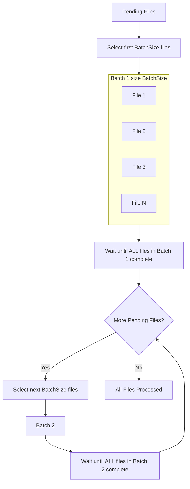

# Concurrent File Download Strategies

## Problem Statement
Our current approach to file caching: Fetch files in fixed-size batches (e.g., 5, 10, 20 at a time). Each batch must wait for the slowest file to finish before the next batch starts. This leads to:
- Head-of-line blocking: one slow download delays all remaining work.
- Underutilized resources: faster downloads sit idle while waiting.
- Hard tuning: picking a single batch size that works for heterogeneous file sizes and network variability is difficult.
- Potential memory pressure if large batches are pre-allocated.

## Fixed Batch Processing (Legacy Behavior Diagram)

## Goal
Stream file downloads with bounded concurrency (a maximum number of simultaneous downloads) while:
- Reducing latency for fast files (they complete as soon as possible).
- Preserving backpressure so production does not overwhelm consumption.
- Providing clear per-download status transitions.
- Supporting cancellation and error isolation.

## Constraints & Requirements
- Limit concurrent downloads (e.g., configurable: 5–50).
- Avoid unbounded internal queues.
- Support cancellation via structured concurrency.
- Record status: Pending → Downloading → Completed | Failed.
- Handle failures without stopping unrelated downloads unless policy requires.

## Solution Approaches
We explore four Kotlin coroutine-based strategies:

### 1. Async–Await (Eager Dispatch)
Create a list of `Deferred` tasks and `awaitAll()`:
- Simple for small, known sets.
- Harder to apply backpressure mid-stream.
- Risk of large spikes if the entire set is launched at once.

### 2. Launch + Semaphore
Use a `Semaphore` to cap concurrent `launch` blocks:
- Straightforward mental model.
- Explicit acquisition/release around each download.
- Requires manual aggregation of results/errors.

### 3. Flow-Based Concurrency
Represent downloads as a cold `Flow` of entries; transform with operators (`flatMapMerge`, `buffer`, etc.):
- Built-in backpressure and composition.
- Natural integration with transformation pipelines (mapping, filtering, metrics).
- Slightly more abstract for imperative status updates.

### 4. Channel (Producer / Consumers)
Use a bounded `Channel` to feed work to consumer coroutines:
- Precise control of capacity and backpressure (send suspends when full).
- Clear producer/consumer separation.
- More boilerplate but flexible for prioritization, retries, and multi-queue designs.

## Comparison (Qualitative)
| Aspect | Async-Await | Semaphore | Flow | Channel |
| ------ | ----------- | --------- | ---- | ------- |
| Backpressure | No | Partial | Yes | Yes |
| Bounded Queue | No | Manual | Yes (buffer) | Yes (capacity) |
| Failure Isolation | Medium | Medium | High | High |
| Code Verbosity | Low | Low | Medium | Medium |
| Flexibility | Low | Medium | High | High |

## When to Choose What
- Use Channel when you need explicit producer/consumer control or advanced scheduling.
- Use Flow when composing transformations or integrating with reactive pipelines.
- Use Semaphore for minimal incremental change to an existing loop.
- Use Async–Await only for small, fixed sets where all tasks can be fired safely.

## Observability & Metrics
Recommended instrumentation:
- Total wall-clock time.
- Average & percentile completion latency (per file).
- Throughput (files/sec).
- Error count & retry statistics.

## Extensions / Future Enhancements
- Retry policy with exponential backoff.
- Priority scheduling (multiple channels / weighted queues).
- Circuit breaker for repeated remote failures.
- Global timeout or cancellation trigger.
- Adaptive concurrency (increase/decrease based on success latency).

**Key Points:**
- A batch starts only after selecting up to `BatchSize` pending files.
- Next batch selection is blocked until every file in the current batch finishes (slowest file dictates batch duration).
- Fast files idle after completion while waiting for the batch barrier.
- Head-of-line blocking occurs when a single large (slow) file delays the start of the next batch.

