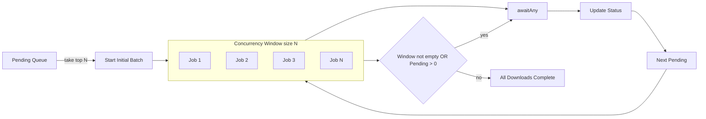

# Async–Await (Eager) Strategy

This module demonstrates replacing fixed-batch downloads with a bounded, moving window of concurrent tasks using Kotlin coroutines and a `select {}`-based `awaitAny()` helper.

## Problem
Fixed-size batches wait for the slowest item in each batch, creating head-of-line blocking and idle time. We want fast items to finish and be reported immediately, while maintaining a concurrency cap.

## Solution Overview
- Launch up to N async download jobs.
- Use `awaitAny()` to atomically select the first job that completes (success or failure).
- Remove the finished job and immediately schedule the next pending download to keep concurrency ~N.
- Update per-download status on success or failure.

## Flow Diagram (Mermaid)

- Concurrency Window holds at most N active async jobs.
- `awaitAny()` uses `select { d.onAwait { d } }` to atomically pick the first completed `Deferred`.
- On each completion, we remove the winner and immediately start the next pending to keep the window full until the queue is empty.

## Benefits
- No head-of-line blocking: fast items finish fast.
- Bounded concurrency: predictable resource usage.
- Continuous throughput: window kept full until queue drains.

## Trade-offs

### Select overhead and scaling
`awaitAny()` builds a `select {}` with one clause per active `Deferred`. Each time a task completes, a new `select` is constructed over the remaining tasks. This introduces O(N) overhead per completion, where N is the current concurrency window size.

What this means in practice:
- For small windows (N ≈ 10–50), the overhead is typically negligible compared to network/disk I/O. The simplicity is worth it.
- For large windows (N ≥ 200–1000), the cost of repeatedly registering `onAwait` clauses can become noticeable, increasing CPU usage and scheduler contention.
- Bursty completions (many tasks finishing close together) may trigger frequent rebuilds of the selection set, amplifying overhead.

Why it happens:
- `select` is single-shot. After a clause wins, other registrations are discarded. The next race needs a fresh `select` with all remaining `Deferred`s.
- Each clause adds a small but real cost: building the clause, registering the await handler, and participating in the selection arbitration.

Guidance:
- Keep N modest unless profiling shows it’s safe. Start with 10–50.

Rule of thumb:
- Use `awaitAny` when N is moderate and tasks are independent