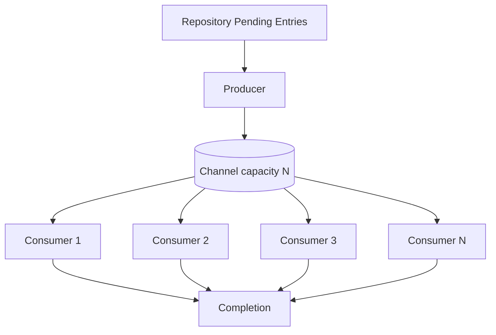

# Channel-Based Concurrency Strategy

This module demonstrates using a bounded `Channel` plus a producer coroutine and a fixed set of consumer workers to maintain at most `BatchSize` concurrent downloads.

## Core Idea
- Producer pulls pending items from the `Repository`, marks them `Downloading`, and sends them into a bounded channel.
- Channel capacity (`BatchSize`) enforces backpressure: `send` suspends when the buffer is full.
- `BatchSize` consumer coroutines receive entries and perform downloads concurrently.
- When the producer exhausts pending entries it closes the channel; consumers finish naturally.

## Mermaid Diagram


## Minimal Orchestrator (Excerpt)
```kotlin
val channel = Channel<DownloadEntry>(capacity = BatchSize)
// Producer
val producer = launch {
    while (true) {
        val next = repository.getNextPendingEntry() ?: break
        repository.setStatus(next, DownloadStatus.Downloading)
        channel.send(next) // suspends if channel full
    }
    channel.close()
}
// Consumers
val consumers = List(BatchSize) {
    launch(Dispatchers.IO) {
        for (entry in channel) {
            Downloader.fetch(entry) // returns Result<DownloadEntry>
                .onSuccess { repository.setStatus(it, DownloadStatus.Completed) }
                .onFailure { repository.setStatus(entry, DownloadStatus.Failed) }
        }
    }
}
producer.join(); consumers.joinAll()
```

## Why a Channel?
- Gives explicit control over the hand-off of work.
- Natural backpressure: producers cannot outrun consumers because `send` suspends when full.
- Straightforward mental model for producer/consumer pipelines.

## Channel vs flatMapMerge (Trade-offs)
| Aspect | Channel (Producer + Workers) | flatMapMerge(concurrency = N) |
| ------ | ---------------------------- | ----------------------------- |
| Concurrency Control | Explicit via number of workers and channel capacity | Declarative via operator parameter (N) |
| Backpressure | Bounded buffer; `send` suspends | Upstream suspension when concurrency slots full (optional buffer before operator) |
| Scheduling Overhead | Constant-time send/receive; one coroutine per worker | Launches a coroutine per inner flow; library manages slot reuse |
| Code Complexity | Manual setup (channel, close, join) | Single pipeline; less boilerplate |
| Composition | Harder to chain transformations; need Flow bridging | Directly composes with other Flow operators |
| Ordering of Results | Completion order naturally from workers | Completion order merge; same effect but integrated |
| Cancellation Semantics | Must cancel producer + all workers explicitly | Collector cancellation propagates to all active inner flows automatically |
| Error Handling | Manual try/catch per consumer | Handle inside inner flow; failures can propagate or be isolated easily |
| Dynamic Scaling | Must launch/stop workers manually | Adjust `concurrency` parameter only |
| Instrumentation | Easy at receive boundaries; manual aggregation | OnEach / map operators provide lighter instrumentation hooks |
| Duplicate Selection Risk | Low if producer alone selects entries | Upstream transform handles selection atomically inside operator |

### When to Prefer Channel
- You need explicit control over buffering semantics or want to plug in priority queues / multiple producer stages.
- You plan to implement advanced features (retry channels, priority lanes, work stealing).
- You want to interleave other non-Flow mechanisms (e.g., select on multiple channels).

### When to Prefer flatMapMerge
- You want minimal coordination code and easy composition with mapping / filtering / batching operators.
- You plan to evolve to multi-stage streaming (parse → transform → persist) where Flow operators shine.
- You want simpler cancellation and structured error propagation out of the box.

## Observability Hooks
Add logging in producer when marking `Downloading` and in consumers after completion to gather per-entry latency and throughput. For richer pipelines, migrate to Flow and compare metrics with `flatMapMerge`.

## Summary
Channel + worker coroutines provide transparent, explicit control with natural backpressure, at the cost of additional boilerplate and weaker composability. `flatMapMerge` yields similar performance characteristics with less code and better integration into declarative pipelines. Choose Channel for bespoke coordination; choose flatMapMerge for rapid evolution and composition.
