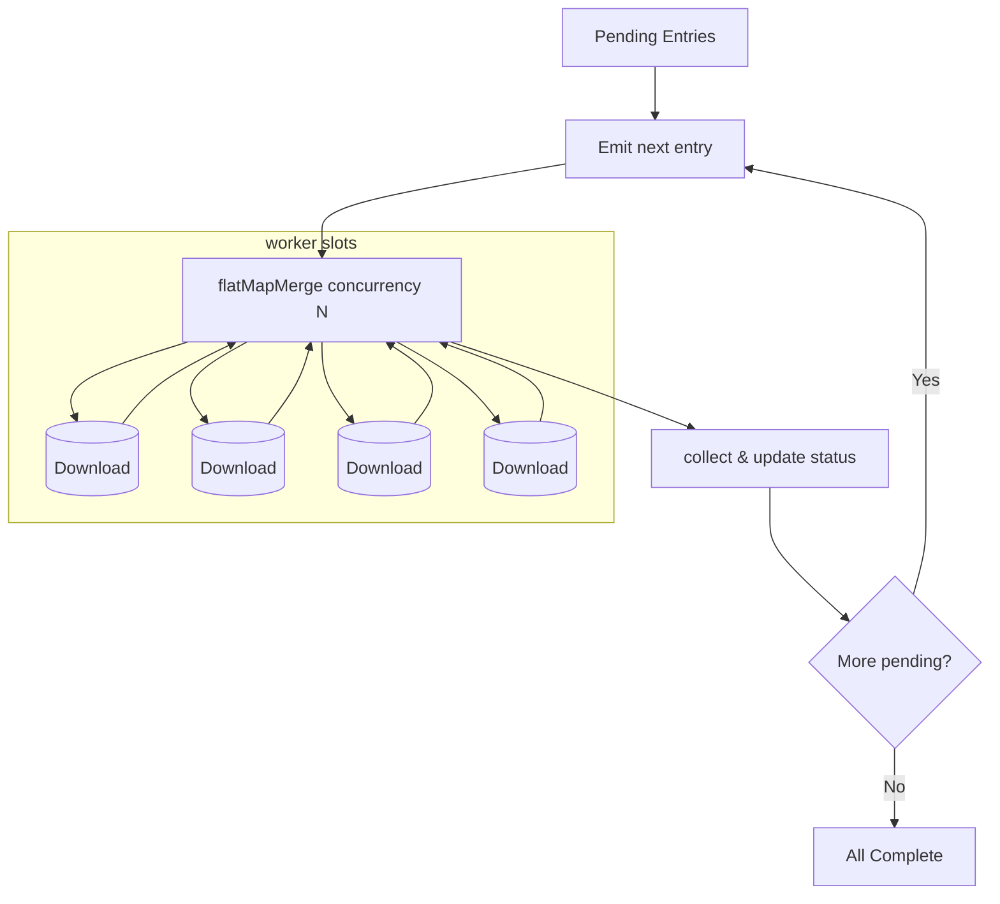

```mermaid
flowchart TD
    P[Pending Entries]
    EMIT[Emit next entry]
    FM[flatMapMerge concurrency N]
    COLLECT[collect & update status]
    CHECK{More pending?}
    DONE[All Complete]

    P --> EMIT --> FM

    subgraph FLATMAP[worker slots]
      FM --> W1[(Download)]
      FM --> W2[(Download)]
      FM --> W3[(Download)]
      FM --> WN[(Download)]
      W1 --> FM
      W2 --> FM
      W3 --> FM
      WN --> FM
    end

    FM --> COLLECT --> CHECK
    CHECK -->|Yes| EMIT
    CHECK -->|No| DONE
```
