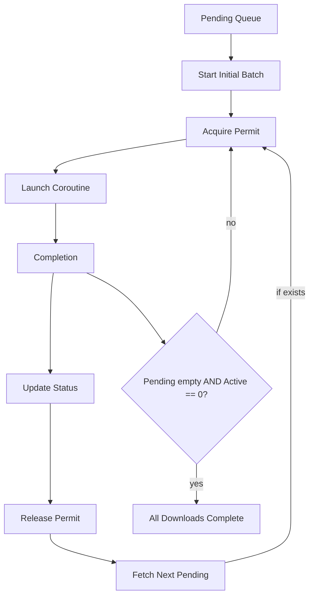

# Launch + Semaphore Strategy

This module demonstrates replacing fixed batch downloads with a bounded, moving window enforced by a `Semaphore` to cap concurrency. Instead of racing completions with `select`, we guard launches with permits so at most **N** downloads run simultaneously.

## Problem
Fixed-size batches wait for the slowest item, producing head-of-line blocking and idle time. We want immediate completion handling for fast files while keeping resource usage predictable.

## Solution Overview
- Create a `Semaphore` with `N` permits (desired max concurrency).
- For each pending entry: acquire a permit, launch a coroutine to download, release permit on completion.
- Continuously attempt to launch new downloads whenever permits become available until queue is empty.
- Update per-download status (Pending → Downloading → Completed/Failed) as jobs start and finish.

## Flow Diagram (Mermaid)


- At most N jobs in the Running Jobs block (enforced by permits).
- Each completion releases a permit, enabling acquisition for the next pending entry.
- The loop continues while there are pending entries or active jobs.

## Key API: Semaphore Usage
```kotlin
val semaphore = Semaphore(concurrency)

suspend fun launchDownload(entry: DownloadEntry) = coroutineScope {
    semaphore.acquire() // blocks if at limit
    launch(Dispatchers.IO) {
        try {
            repository.setStatus(entry, DownloadStatus.Downloading)
            downloader.fetch(entry.url)
            repository.setStatus(entry, DownloadStatus.Completed)
        } catch (e: Throwable) {
            repository.setStatus(entry, DownloadStatus.Failed)
        } finally {
            semaphore.release()
        }
    }
}
```

## Orchestration Sketch
```kotlin
val semaphore = Semaphore(N)
val scope = CoroutineScope(SupervisorJob() + Dispatchers.IO)
val pending = repository.getTopPendingEntries(N)

pending.forEach { launchDownload(it) }

while (repository.pendingCount() > 0 || /* active jobs */ true) {
    // Try to start more while permits available
    while (semaphore.availablePermits > 0) {
        val next = repository.getNextPendingEntry() ?: break
        launchDownload(next)
    }
    delay(10) // small idle / or use a completion channel instead
    // Break when no pending and all permits free (no active jobs)
    if (repository.pendingCount() == 0 && semaphore.availablePermits == N) break
}
```

## Benefits
- Straightforward concurrency cap: permits model available slots explicitly.
- Easy to retrofit into existing `launch` loops.
- Clear lifecycle: acquire → run → release.

## Trade-offs

### Semaphore contention and scaling
Using a `Semaphore` yields *O(1)* acquisition per task, but introduces contention and coordination points that grow noticeable as concurrency increases.

What happens:
- Every new download attempts `semaphore.acquire()`. When N is saturated, coroutines suspend awaiting a permit.
- Burst completions wake multiple waiting coroutines; they contend to acquire permits (thundering herd effect).
- At very high N (hundreds), frequent acquire/release cycles can elevate lock contention and context switching.

Symptoms:
- Increased scheduler churn: many coroutines suspended/resumed around permit boundaries.
- CPU spikes during large completion waves.

Guidance:
- Keep concurrency moderate (10–100) unless profiling validates higher values.
- If bursts dominate, consider a `Channel` or `Flow` pipeline to smooth handoff and unify backpressure.
- Avoid tight polling loops; prefer a completion channel to signal when a permit was released.

Rule of thumb:
- Use the semaphore pattern for simple caps and small/medium concurrency.
- Switch to channel/flow when you need richer backpressure semantics or very large N.

## Try It
- Integrate the semaphore orchestrator in `Main.kt` for the launch-semaphore module.
- Adjust `N` and measure wall time / CPU usage.

## Next Steps
- Replace polling with a completion `Channel` to eliminate idle delays.
- Add retries with exponential backoff.
- Introduce priority (multiple semaphores or weighted permits).
- Add instrumentation: average latency, current active count, throughput.
